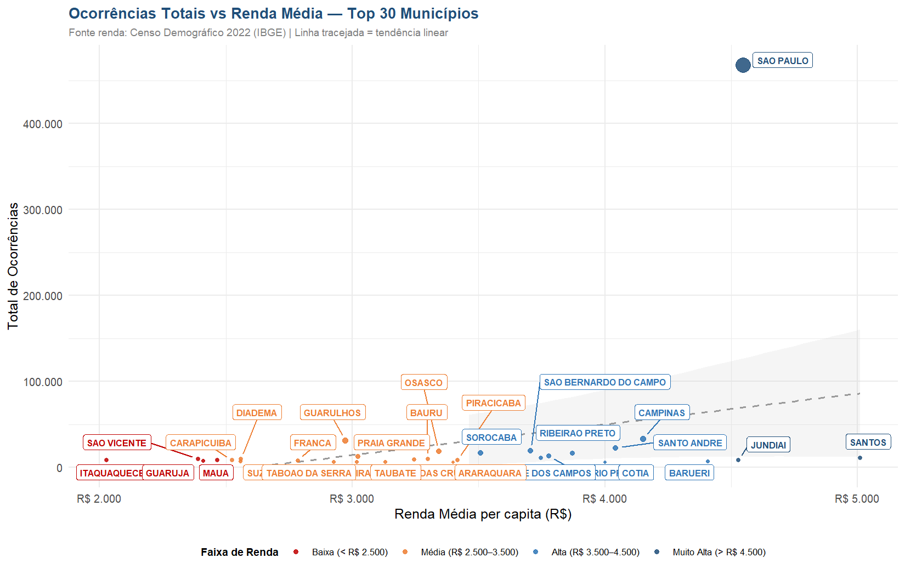
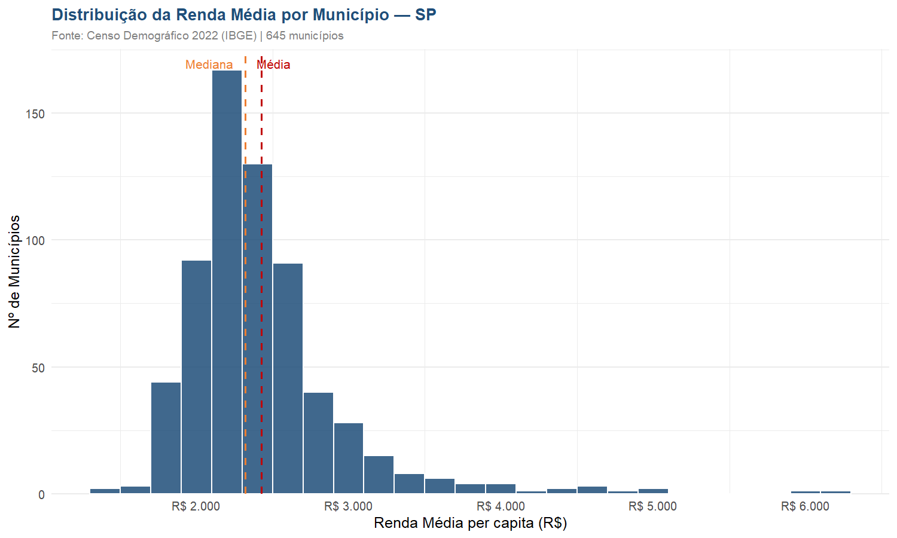
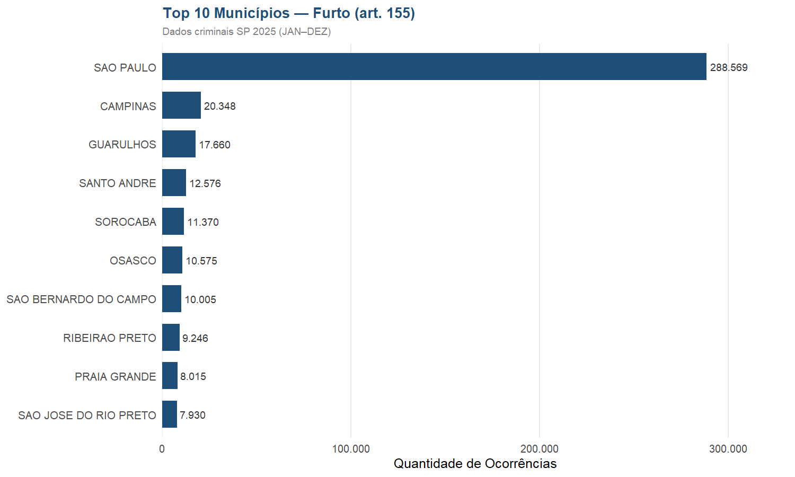
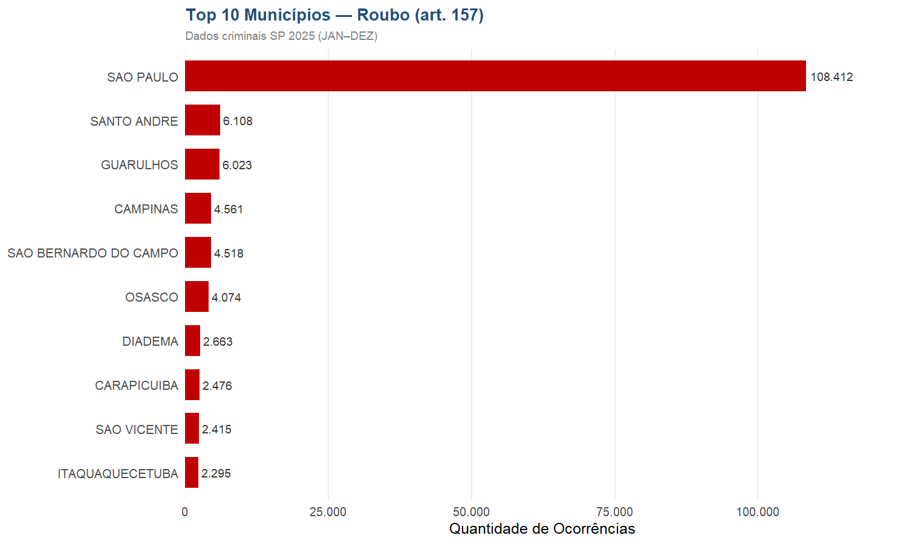
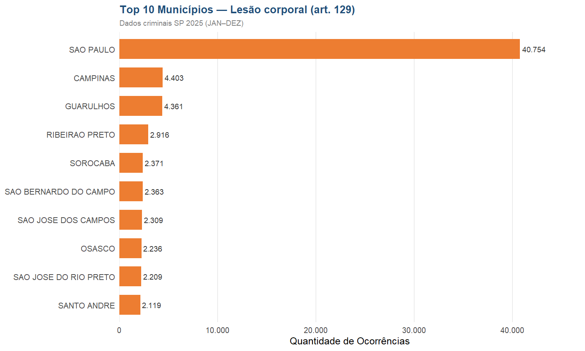
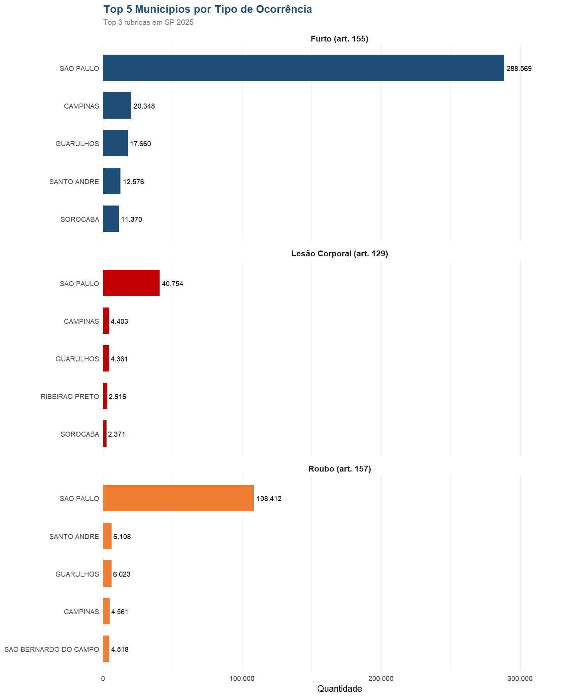

# Análise de Dados para Planejamento Territorial

Com o apoio da professora **Flávia da Fonseca Feitosa**, estruturamos a pesquisa de relacionar casos criminais dos municípios de São Paulo com a renda média (dados do Censo Demográfico 2022 do IBGE). A partir disso queremos responder a seguinte hipótese:

> **Acontecem mais crimes nas cidades mais pobres?**

---

## 🗂️ Estrutura do Repositório

```
territory/
├── docs/                              # Bases de dados e outputs
│   ├── base_tratada_2025.xlsx         # Base criminal consolidada (JAN–DEZ 2025)
│   ├── Renda_por_Municipio_-_SP.xlsx  # Renda média per capita — Censo 2022
│   ├── analise_2025.xlsx              # Resultado das análises
│   └── *.png                          # Gráficos gerados
└── src/                               # Código-fonte
    ├── main.R                         # Script principal
    ├── analise.R                      # Funções de agregação
    ├── graficos.R                     # Funções de visualização
    └── utils.R                        # Funções auxiliares
```

---

## 🛠️ Tecnologias Utilizadas

| Tecnologia | Descrição |
|---|---|
| **R 4.6** | Linguagem principal de análise |
| **RStudio** | IDE para desenvolvimento |
| `readxl` | Leitura de arquivos Excel |
| `openxlsx` | Escrita de arquivos Excel |
| `dplyr` | Manipulação de dados |
| `ggplot2` | Visualização de dados |
| `ggrepel` | Labels sem sobreposição nos gráficos |
| `stringi` | Normalização de texto |
| `tidytext` | Ordenação em gráficos facetados |
| `scales` | Formatação de eixos nos gráficos |
| **Git + GitHub** | Versionamento de código |

---

## 📊 Fontes de Dados

| Base | Fonte | Descrição |
|---|---|---|
| Dados Criminais SP 2025 | [SSP-SP](https://www.ssp.sp.gov.br/estatistica/dados-mensais) | Ocorrências criminais por município — JAN a DEZ 2025 |
| Renda Média por Município | [IBGE — Censo 2022](https://cidades.ibge.gov.br/) | Renda média per capita de pessoas com 14 anos ou mais — 645 municípios de SP |

---

## ⚙️ Fluxo de Execução

```
SPDadosCriminais_2025.xlsx
        │
        ▼
  Leitura das sheets
  JAN-JUN_2025 + JUL-DEZ_2025
        │
        ▼
  Concatenação e seleção
  de colunas relevantes
  (base_tratada_2025.xlsx)
        │
        ▼
  Normalização dos nomes       Renda_por_Municipio_-_SP.xlsx
  de municípios          ───────────────┘
        │
        ▼
  Join: ocorrências × renda média
        │
        ├──▶ analise_2025.xlsx
        │     ├── Ocorr_x_Renda
        │     ├── Top5_por_Rubrica
        │     ├── Contagem_Rubrica
        │     ├── Estatisticas_Renda
        │     └── Estatisticas_Ocorr
        │
        └──▶ Gráficos PNG
```

Para reproduzir a análise completa, basta rodar:

```r
source("src/main.R")
```

> ⚠️ O arquivo `SPDadosCriminais_2025.xlsx` não está incluído no repositório por exceder o limite de tamanho do GitHub (187 MB). Faça o download diretamente no site da SSP-SP e salve em `docs/`.

---

## 🗺️ Pipeline de Análise Espacial

Análise de correlação e autocorrelação espacial (Moran's I global e LISA) das taxas de roubo, furto e lesão corporal por 1.000 habitantes, com mapas coropléticos. Tudo scriptado — sem passo manual no QGIS:

```bash
Rscript run_espacial.R
```

O pipeline (em `src/espacial/`, pacotes `sf`, `spdep`, `geobr`, `corrplot`):

1. Constrói e valida `data/tabelao.csv` (uma linha por município, chave `cod_ibge`) a partir das bases em `docs/`;
2. Gera `data/litoranea_turistica.csv` — classificação **editável** dos municípios litorâneos/turísticos (revise e reexecute);
3. Baixa a malha de municípios de SP (IBGE, via `geobr`) com cache em `data/`;
4. Exporta para `outputs/`: top 5 por crime, matrizes de correlação (figura + CSV), dispersões, Moran's I global, mapas de clusters LISA, mapas coropléticos e o relatório `outputs/relatorio.md`.

---

## 🔍 Hipótese

> **Acontecem mais crimes nas cidades mais pobres?**

Para investigar essa questão, cruzamos o total de ocorrências criminais registradas em cada município de São Paulo com a renda média per capita (Censo Demográfico 2022, IBGE). A análise considera os **3 tipos de crime mais frequentes** no estado:

1. Furto (art. 155)
2. Roubo (art. 157)
3. Lesão Corporal (art. 129)

---

## 📈 Visualizações

### Ocorrências vs Renda Média


### Distribuição da Renda por Município


### Top 10 Municípios — Furto


### Top 10 Municípios — Roubo


### Top 10 Municípios — Lesão Corporal


### Top 5 por Tipo de Ocorrência


---

## 📚 Referências de Termos Técnicos

**Correlação**
Medida estatística que indica a relação entre duas variáveis. Uma correlação positiva significa que quando uma variável aumenta, a outra tende a aumentar também. Não implica causalidade.
→ [Saiba mais](https://pt.wikipedia.org/wiki/Coeficiente_de_correla%C3%A7%C3%A3o_de_Pearson)

**Causalidade**
Relação em que uma variável causa diretamente a mudança em outra. Diferente de correlação, exige evidência mais robusta para ser estabelecida.
→ [Saiba mais](https://pt.wikipedia.org/wiki/Causalidade)

**Outlier**
Valor que se distancia significativamente dos demais em um conjunto de dados. Nesta análise, São Paulo se comporta como outlier por concentrar volume de ocorrências muito superior aos demais municípios.
→ [Saiba mais](https://pt.wikipedia.org/wiki/Outlier)

**Rubrica**
Neste contexto, categoria jurídica do crime conforme o Código Penal Brasileiro (ex: Furto — art. 155).

**Renda Média per capita**
Indicador do IBGE que expressa a renda média das pessoas com 14 anos ou mais em um município, em reais, conforme o Censo Demográfico 2022.

**Normalização de dados**
Processo de padronizar valores para permitir comparação entre fontes diferentes — neste projeto, aplicado aos nomes dos municípios para cruzar as bases da SSP-SP e do IBGE.

---
## 👥 Integrantes

| Nome | GitHub |
|---|---|
| João Vitor Oliveira | [@joaooliveira23](https://github.com/joaooliveira23) |
| Julio Cesar Salvino | [@euusoujc](https://github.com/euusoujc) |
| Lucas Amorim | [@lucamorim](https://github.com/lucamorim) |

---

## 👩‍🏫 Orientação

**Professora Flávia da Fonseca Feitosa**
