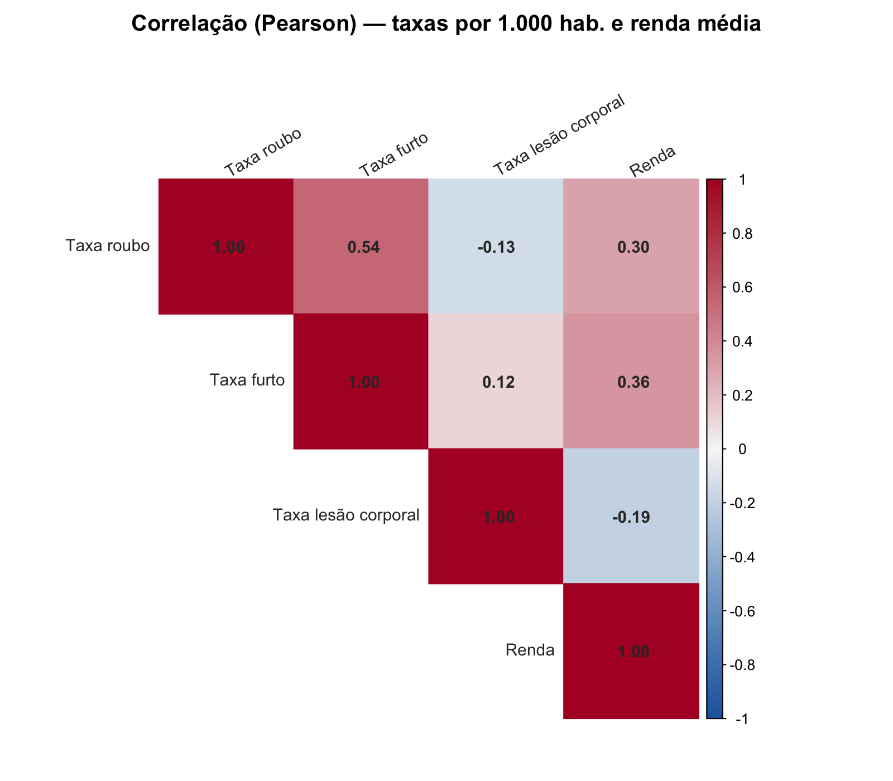
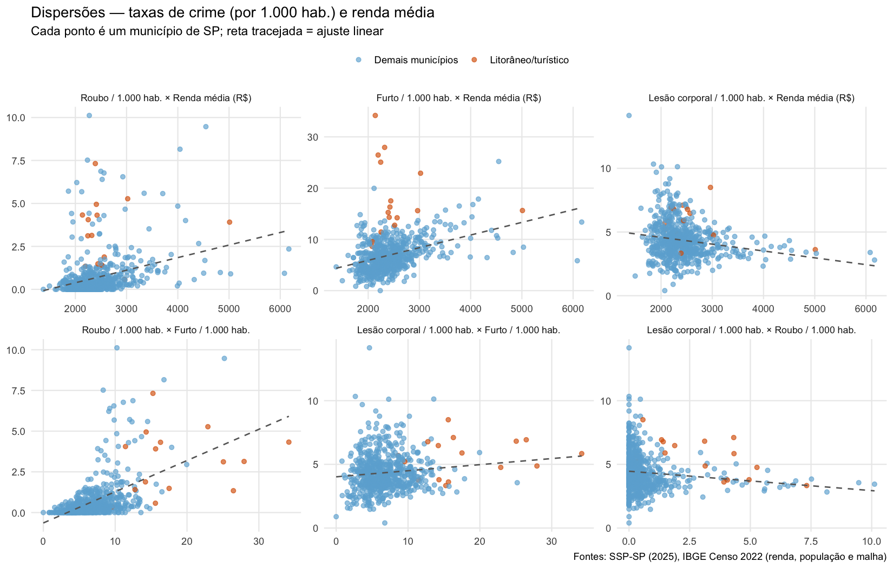
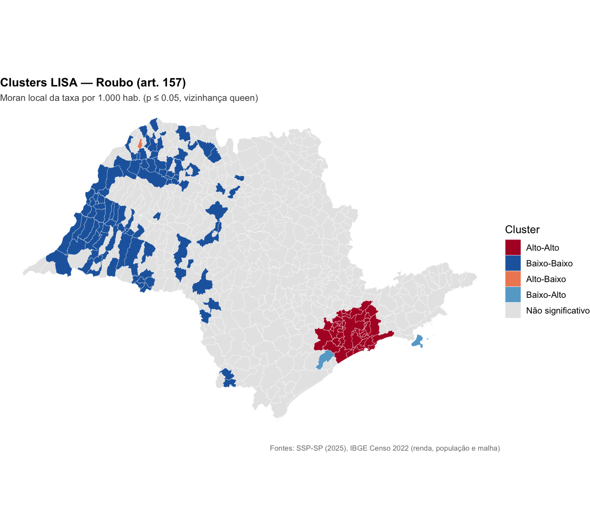
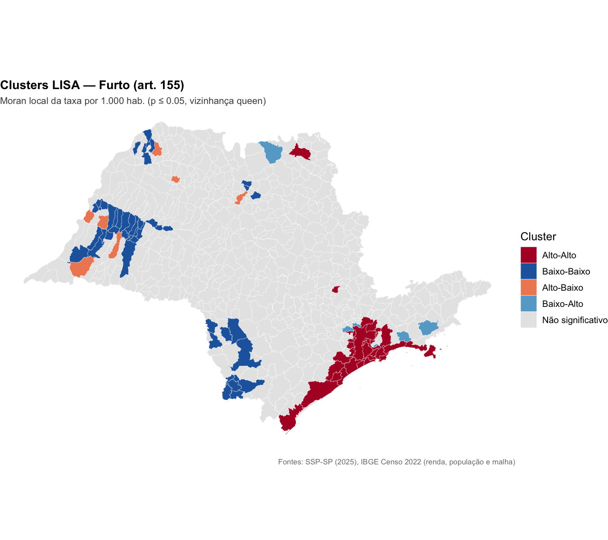
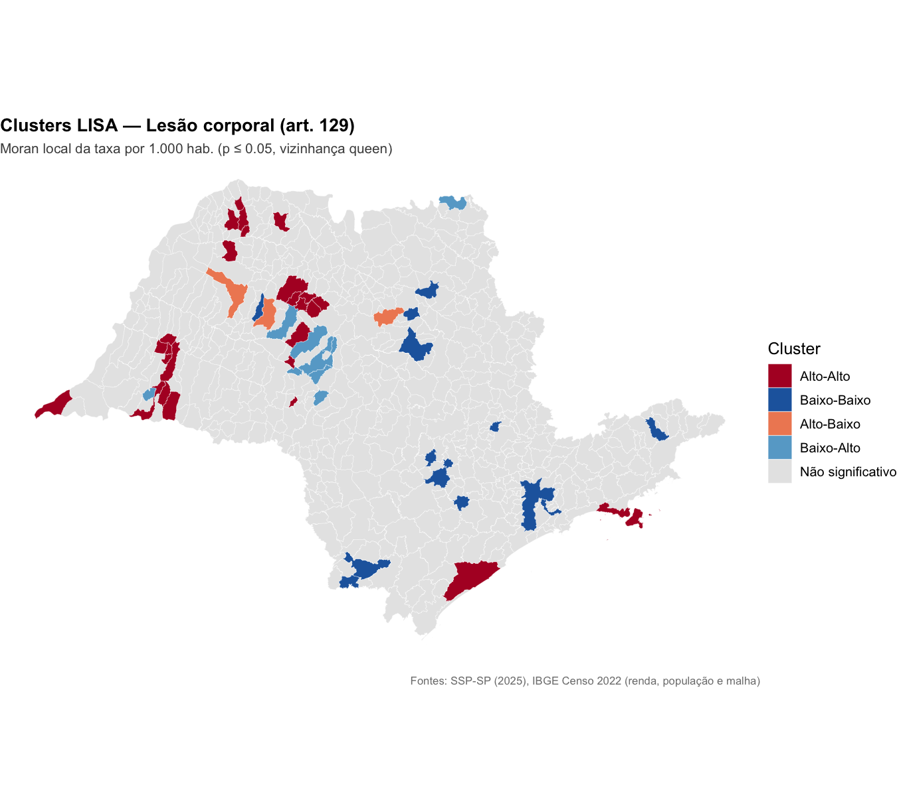
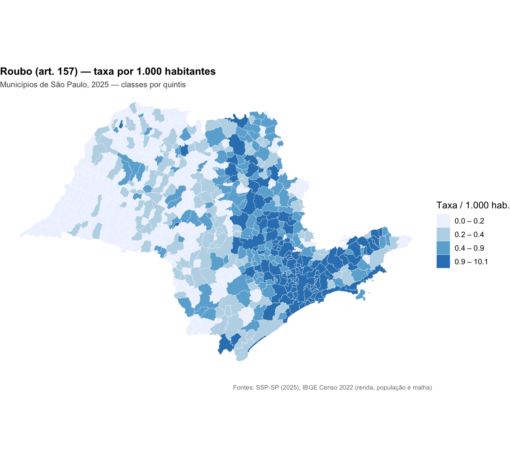
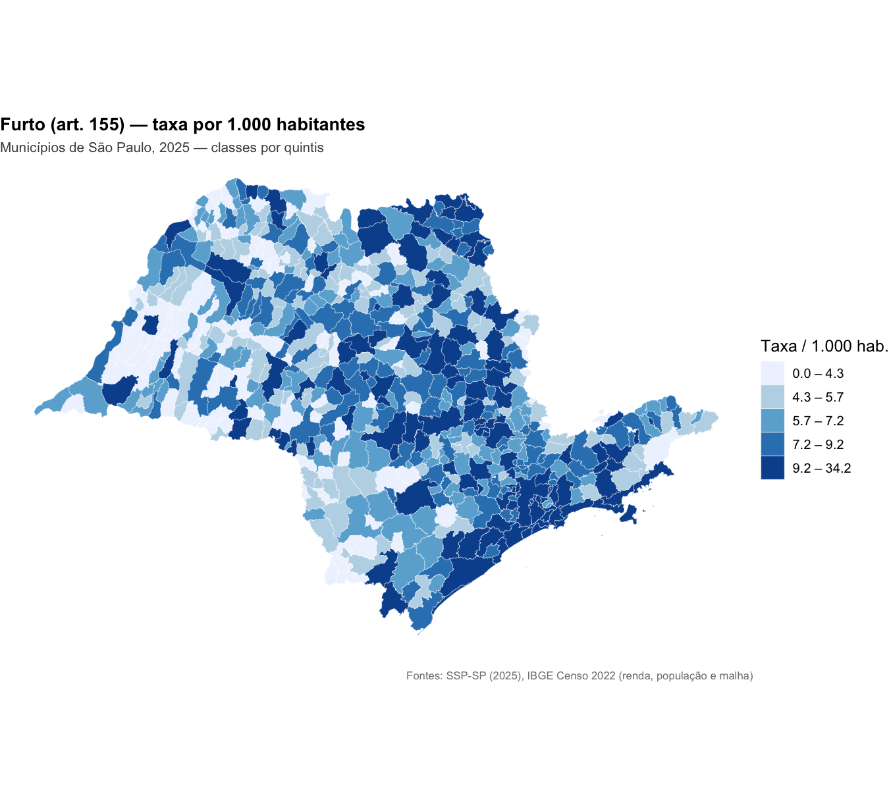
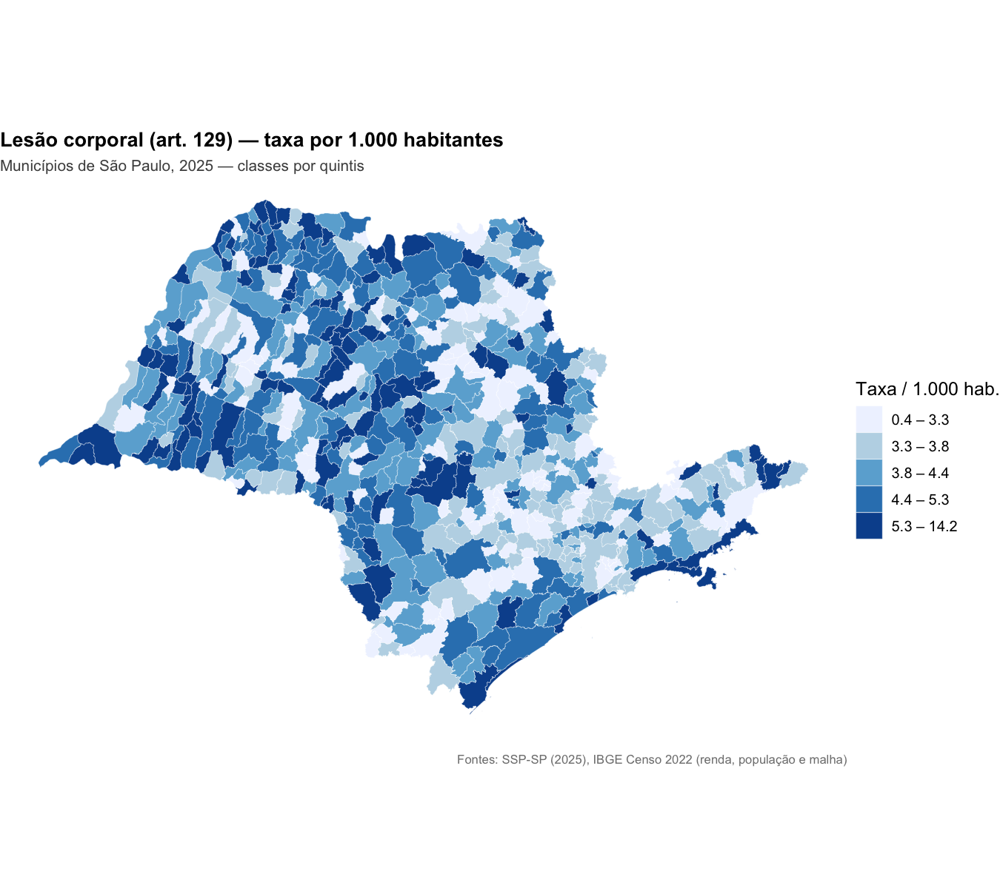

# Análise espacial da criminalidade — municípios de SP (2025)

_Gerado automaticamente por `run_espacial.R` em 27/07/2026._

Crimes analisados: roubo (art. 157), furto (art. 155) e lesão corporal (art. 129),
em taxas por 1.000 habitantes (população: IBGE Tabela 4709, Censo 2022).

## 1. Validação do tabelão

- `data/tabelao.csv`: **645 municípios**, chave `cod_ibge` única e no padrão SP (35xxxxx).
- Municípios com renda ausente: **0**.
- Detalhes em `outputs/validacao_tabelao.txt`.

## 2. Classificação litorânea/turística

- **16** municípios marcados como litorâneos/turísticos (default: os 16 do litoral paulista).
- ⚠️ Classificação default gerada pelo pipeline — **revisar/editar `data/litoranea_turistica.csv`** e reexecutar.

Médias por grupo:

| grupo | n | taxa_roubo_1000 | taxa_furto_1000 | taxa_lesao_1000 | renda_media |
| --- | --- | --- | --- | --- | --- |
| Demais | 629 | 0.64 |  6.68 | 4.32 | 2424 |
| Litorâneo/turístico |  16 | 2.98 | 17.98 | 5.59 | 2566 |

## 3. Top 5 municípios por taxa (por 1.000 hab.)

| crime | municipio | populacao | taxa_por_1000 | litoranea_turistica |
| --- | --- | --- | --- | --- |
| Roubo (art. 157) | Itapecerica da Serra |   158522 | 10.118 | 0 |
| Roubo (art. 157) | São Paulo | 11451999 |  9.467 | 0 |
| Roubo (art. 157) | Santo André |   748919 |  8.156 | 0 |
| Roubo (art. 157) | Embu das Artes |   250691 |  7.519 | 0 |
| Roubo (art. 157) | São Vicente |   329911 |  7.320 | 1 |
| Furto (art. 155) | Mongaguá |    61951 | 34.172 | 1 |
| Furto (art. 155) | Itanhaém |   112476 | 27.944 | 1 |
| Furto (art. 155) | Ilha Comprida |    13419 | 26.455 | 1 |
| Furto (art. 155) | São Paulo | 11451999 | 25.198 | 0 |
| Furto (art. 155) | Peruíbe |    68352 | 25.061 | 1 |
| Lesão corporal (art. 129) | Balbinos |     3887 | 14.150 | 0 |
| Lesão corporal (art. 129) | Santo Expedito |     3000 | 10.333 | 0 |
| Lesão corporal (art. 129) | Rifaina |     4049 | 10.126 | 0 |
| Lesão corporal (art. 129) | Guarantã |     6427 | 10.114 | 0 |
| Lesão corporal (art. 129) | Pontalinda |     4127 |  9.692 | 0 |

Dos 15 municípios listados, **5 (33%)** são litorâneos/turísticos — consistente com a observação da reunião sobre população flutuante de verão inflar as taxas (o denominador usa população residente).

## 4. Correlações (taxas × renda)

Pearson:

|   | Taxa roubo | Taxa furto | Taxa lesão corporal | Renda |
| --- | --- | --- | --- | --- |
| Taxa roubo |  1.000 | 0.544 | -0.131 |  0.302 |
| Taxa furto |  0.544 | 1.000 |  0.116 |  0.359 |
| Taxa lesão corporal | -0.131 | 0.116 |  1.000 | -0.190 |
| Renda |  0.302 | 0.359 | -0.190 |  1.000 |

Spearman (robusta a outliers como São Paulo):

|   | Taxa roubo | Taxa furto | Taxa lesão corporal | Renda |
| --- | --- | --- | --- | --- |
| Taxa roubo |  1.000 | 0.567 | -0.177 |  0.389 |
| Taxa furto |  0.567 | 1.000 |  0.084 |  0.380 |
| Taxa lesão corporal | -0.177 | 0.084 |  1.000 | -0.166 |
| Renda |  0.389 | 0.380 | -0.166 |  1.000 |

## 5. Autocorrelação espacial

### Moran's I global (vizinhança queen, pesos row-standardized, 999 permutações)

| crime | moran_I | p_valor |
| --- | --- | --- |
| Roubo (art. 157) | 0.832 | 0.001 |
| Furto (art. 155) | 0.422 | 0.001 |
| Lesão corporal (art. 129) | 0.181 | 0.001 |

- **Roubo (art. 157)**: I = 0.832 — autocorrelação espacial positiva forte, significativa (p = 0.001).
- **Furto (art. 155)**: I = 0.422 — autocorrelação espacial positiva moderada, significativa (p = 0.001).
- **Lesão corporal (art. 129)**: I = 0.181 — autocorrelação espacial positiva fraca, significativa (p = 0.001).

### Clusters LISA (Moran local, p ≤ 0,05)

| crime | Alto-Alto | Baixo-Baixo | Alto-Baixo | Baixo-Alto | Não significativo |
| --- | --- | --- | --- | --- | --- |
| Furto (art. 155) | 36 | 45 | 7 | 6 | 551 |
| Lesão corporal (art. 129) | 22 | 28 | 5 | 6 | 584 |
| Roubo (art. 157) | 45 | 93 | 1 | 2 | 504 |

- **Furto (art. 155)**: 36 municípios em cluster Alto-Alto, dos quais 13 (36%) litorâneos/turísticos.
- **Lesão corporal (art. 129)**: 22 municípios em cluster Alto-Alto, dos quais 2 (9%) litorâneos/turísticos.
- **Roubo (art. 157)**: 45 municípios em cluster Alto-Alto, dos quais 8 (18%) litorâneos/turísticos.

## 6. Mapas coropléticos (taxas por 1.000 hab.)

## 7. Leitura e limitações

- Os mapas e o LISA indicam concentração espacial das taxas mais altas na faixa litorânea e na Região Metropolitana, em linha com a hipótese de população flutuante turística.
- **Taxas por população residente superestimam o risco em cidades turísticas**: o denominador ignora a população flutuante de verão.
- Correlação não implica causalidade; o Moran's I é sensível à escolha da matriz de vizinhança (aqui, contiguidade queen).
- Municípios-ilha (ex.: Ilhabela) podem ficar sem vizinhos na matriz de contiguidade e não recebem classificação LISA significativa.

---
_Fontes: SSP-SP (2025), IBGE Censo 2022 (renda, população e malha)._
